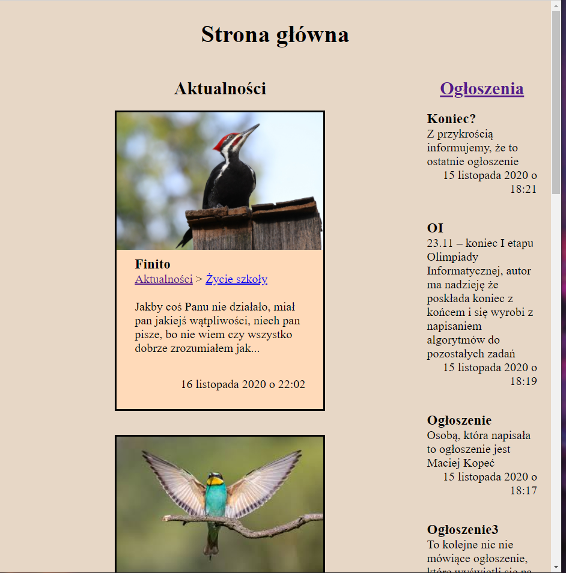
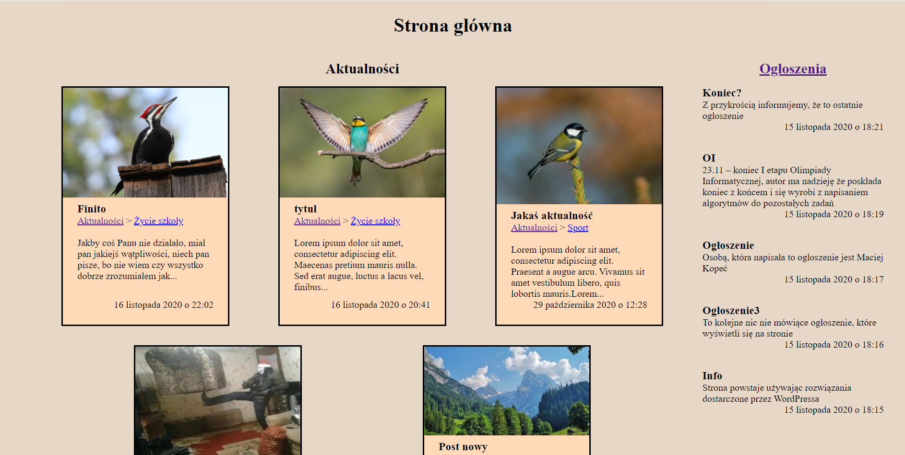
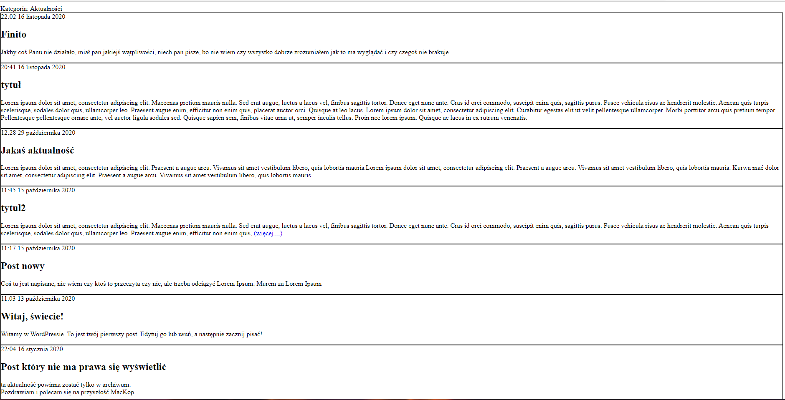
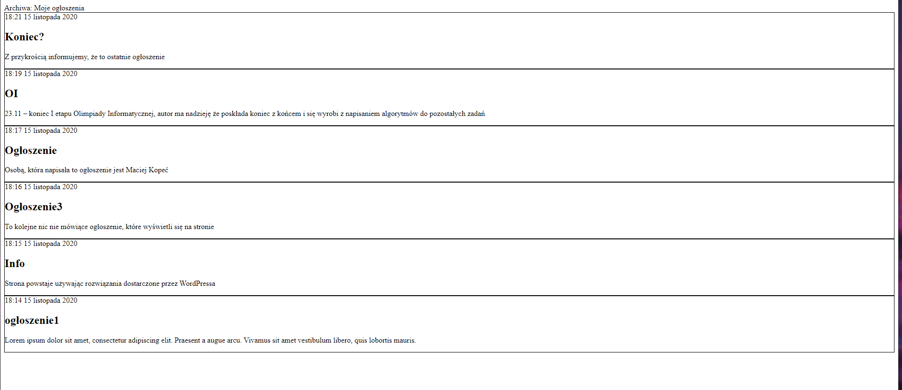

Jakby czegoś brakowało, były jakieś problemy, proszę pisać
(z takich drobnostek to do archiwum można by było dodać tak samo wyświetlanie miniaturek, no ale to anologicznie tak jak we front page)

U mnie działa i wygląda to tak:

